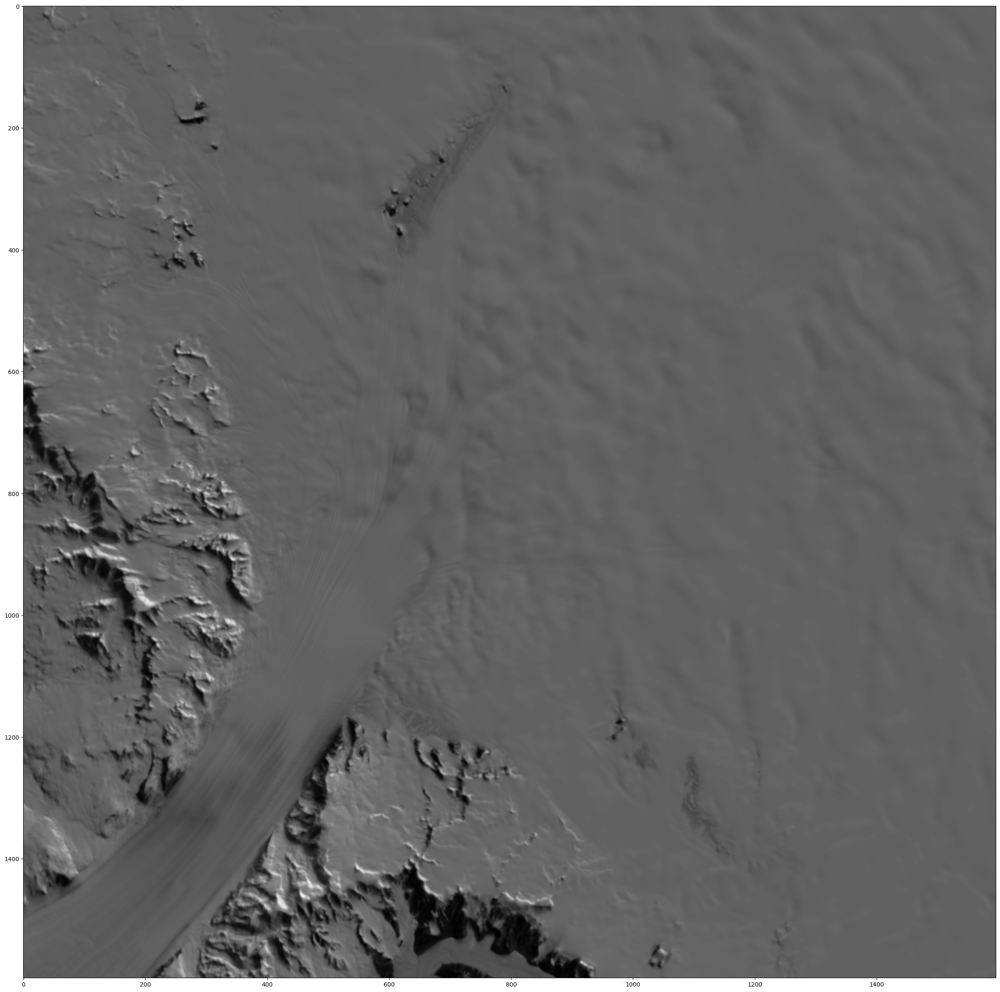

# What this repository contains

- Visualisations of MODIS MOA for 
  - Antarctica
  - the Byrd glacier region
- Conversion of the tif data set into a pt tensor with grid
- Subsetting a region (Byrd glaicer) given the wanted Polar Stereographic coordinates.
- Generation of the corresponding coordinate grid (meshgrid) for the Byrd glaicer data.

# MODIS MOA data

Data set: MEaSUREs MODIS Mosaic of Antarctica 2013-2014 (MOA2014) Image Map, Version 1

- [Data repo](https://daacdata.apps.nsidc.org/pub/DATASETS/nsidc0730_MEASURES_MOA2014_v01/)  
- [User guide](https://nsidc.org/sites/default/files/nsidc-0730-v001-userguide.pdf)

## Download

First, download MODIS data from earthdata. We use file `moa125_2014_hp1_v01.tif` from https://daacdata.apps.nsidc.org/pub/DATASETS/nsidc0730_MEASURES_MOA2014_v01/geotiff/

You can follow these steps:
- Create file: nano ~/.netrc
- Add credentials: 
    - machine urs.earthdata.nasa.gov
    - login your_earthdata_username
    - password your_earthdata_password
- Secure file: chmod 0600 ~/.netrc
- Run: wget --load-cookies ~/.urs_cookies --save-cookies ~/.urs_cookies --keep-session-cookies --auth-no-challenge https://daacdata.apps.nsidc.org/pub/DATASETS/nsidc0730_MEASURES_MOA2014_v01/geotiff/moa125_2014_hp1_v01.tif

## Images/maps

From documentations:

grn: Weighted optical grain size image; 16-bit unsigned-integer little-endian flat binary
hp1: High-pass band 1 surface morphology image; 16-bit unsigned-integer little-endian flat
binary

So both are single channel images at 750m res. 

The size is thus: (6964, 8056)

[text](blob:vscode-webview%3A//1to4iq2h89abk3nqfea3e60hifiqbj7d3p88u0ue3irp40pnjtdr/920e6f01-bcba-4859-b9ab-c71de296f978)

## Geoindexing:

Corner coordinates where contained in the documentation, see [here](https://nsidc.org/sites/default/files/nsidc-0730-v001-userguide.pdf).

## Byrd crop of dataset

Pytorch tensors are exported as well.